<div align="center">
  
</div>

```text
GENERAL NOTES
 1. ALL WORK DESIGNED AND BUILT BY THE UNDERSIGNED.
 2. SECURITY CONSIDERATIONS APPLY TO ALL SHEETS.
 3. DRAWINGS NOT TO SCALE. AMBITION IS.
```

## `A-101` · SITE PLAN

BSc **Security Studies** at Leiden University (The Hague), building toward **AI governance and cybersecurity**. Before that: an Advanced Diploma in Sound Engineering from Abbey Road Institute Amsterdam. I like systems you can hear, break, or govern, and I would rather build the thing than write a memo about the thing.

## `A-201` · SECTION A-A · BUILT WORKS

<div align="center">
  
</div>

| LVL | WORK | PROGRAM | STATUS |
|:---:|:---|:---|:---|
| L04 | **Score Analyser** | Music-information-retrieval pipeline. Viterbi-decoded chord segmentation, raised from 37% to 81.85% accuracy on POP909, verified by a sandboxed regression harness. `Python · Claude API · React` | `COMMISSIONED` 🔒 |
| L03 | **Operation Nexus** | Full-stack crisis-simulation platform built for a Leiden security course: scenario engine, card grammar, printable session records. `Next.js · Vercel · Neon` | `DELIVERED` 🔒 |
| L02 | **Chord Architect** | VST3/AU plug-in and studio companion to the Conservatory. Multi-track MIDI export engine. `C++ · JUCE` | `TOPPED OUT` 🔒 |
| L01 | **Harmonic Conservatory** | Gamified music-education SaaS under the Nebula ScoreWorks brand: voicing engine, chord palette, Culture &amp; Eras Explorer. `Vanilla JS · Web Audio API` | `IN SERVICE` 🔒 |

<sub>🔒 RESTRICTED ACCESS · code private, work real. Site access on request.</sub>

## `A-301` · STRUCTURAL SYSTEMS

| SYSTEM | SPECIFICATION |
|:---|:---|
| **FOUNDATION** | Python · JavaScript / TypeScript · C++ |
| **SUPERSTRUCTURE** | React · Next.js · Node · JUCE |
| **BUILDING SERVICES** | Claude API / MCP · Web Audio API · REST · PostgreSQL (Neon) |
| **SITE &amp; PLANT** | Linux (Arch · Parrot) · Git · Vercel |

## `A-401` · UNDER CONSTRUCTION

- [x] Core engines topped out: voicing, chord palette, Enhance
- [ ] Building services for the Conservatory: backend, auth, payments
- [ ] ISC2 Certified in Cybersecurity
- [ ] EU AI Act, visual explainer series
- [ ] MSc Cybersecurity Governance (scheduled 2028)

## `A-501` · SPECIFICATIONS

<div align="center">
  
  
</div>

## REVISIONS

| REV | DATE | DESCRIPTION | BY |
|:---:|:---|:---|:---:|
| 01 | 2023 | SITE ESTABLISHED · FIRST REPOSITORIES POURED | A.K. |
| 02 | 2026-07 | FULL RE-ISSUE AS BLUEPRINT SET | A.K. |

<div align="center">

**[PORTFOLIO](https://dhm-ak.github.io)** · **[LINKEDIN](https://www.linkedin.com/in/attila-kondor-627a47329/)** · **[INSTAGRAM](https://instagram.com/dhm_ak)**

<sub>SHEET SET A-000 TO A-501 · ISSUED FOR CONSTRUCTION · THE HAGUE, NL</sub>

</div>
