  

**BSc Security Studies** at Leiden University, The Hague, building toward **AI governance and cybersecurity**. Trained as a sound engineer first (Abbey Road Institute Amsterdam); I would rather build the thing than write the memo about the thing.

  

`PYTHON · TYPESCRIPT · C++ · REACT · NEXT.JS · JUCE · CLAUDE API / MCP · WEB AUDIO API · POSTGRESQL · LINUX · GIT`

🔒 FLAGSHIP REPOS PRIVATE · WORK REAL · SITE ACCESS ON REQUEST

**[PORTFOLIO](https://dhm-ak.github.io)** · **[LINKEDIN](https://www.linkedin.com/in/attila-kondor-627a47329/)** · **[INSTAGRAM](https://instagram.com/dhm_ak)**

SHEET SET A-000 / A-201 · THE HAGUE, NL · DRAWINGS NOT TO SCALE, AMBITION IS

